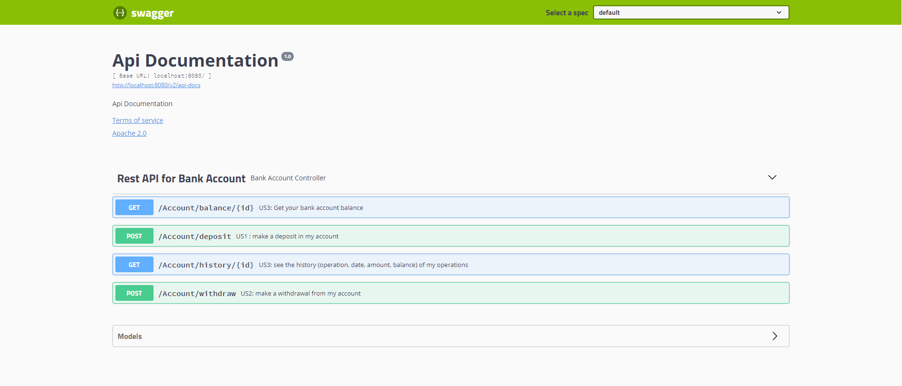

# Bank account kata with Rest API architecture.

Bank account kata using Spring boot Application with H2 embedded database.

Think of your personal bank account experience When in doubt, go for the simplest solution
## Requirments
#### - Deposit and Withdrawal
#### - Account statement (date, amount, balance)
#### - Statement printing

## User Stories

### US 1:
In order to save money
As a bank client
I want to make a deposit in my account
#### POST /Account/deposit
BODY : {"id":1, "amount":1000}

### US 2:
In order to retrieve some or all of my savings
As a bank client
I want to make a withdrawal from my account
#### POST /Account/withdraw
BODY : {"id":1, "amount":1000}

### US 3:
In order to check my operations
As a bank client
I want to see the history (operation, date, amount, balance) of my operations
#### GET /Account/history/{id}
#### GET /Account/balance/{id}


## Getting Started

To clone this repository, execute the following in the command line:
```bash
$ git clone https://github.com/acherbas/bank-account.git
```

You can build the application with:
```bash
$ mvn clean install
```

You can run the application with:
```bash
$ mvn spring-boot:run
```

You can run tests for the application with:
```bash
$ mvn test
```

## Project database :
H2 http://localhost:8080/h2-ui/

## API Rest documentation :
Swagger http://localhost:8080/swagger-ui/


## Built With
* [Spring Boot 2.5.2](https://start.spring.io/)
* [Java 11](https://www.oracle.com/fr/java/technologies/javase-jdk11-downloads.html)
* [Maven](https://maven.apache.org/)
* [Swagger](https://swagger.io/)
* [H2 database](https://www.h2database.com/)


